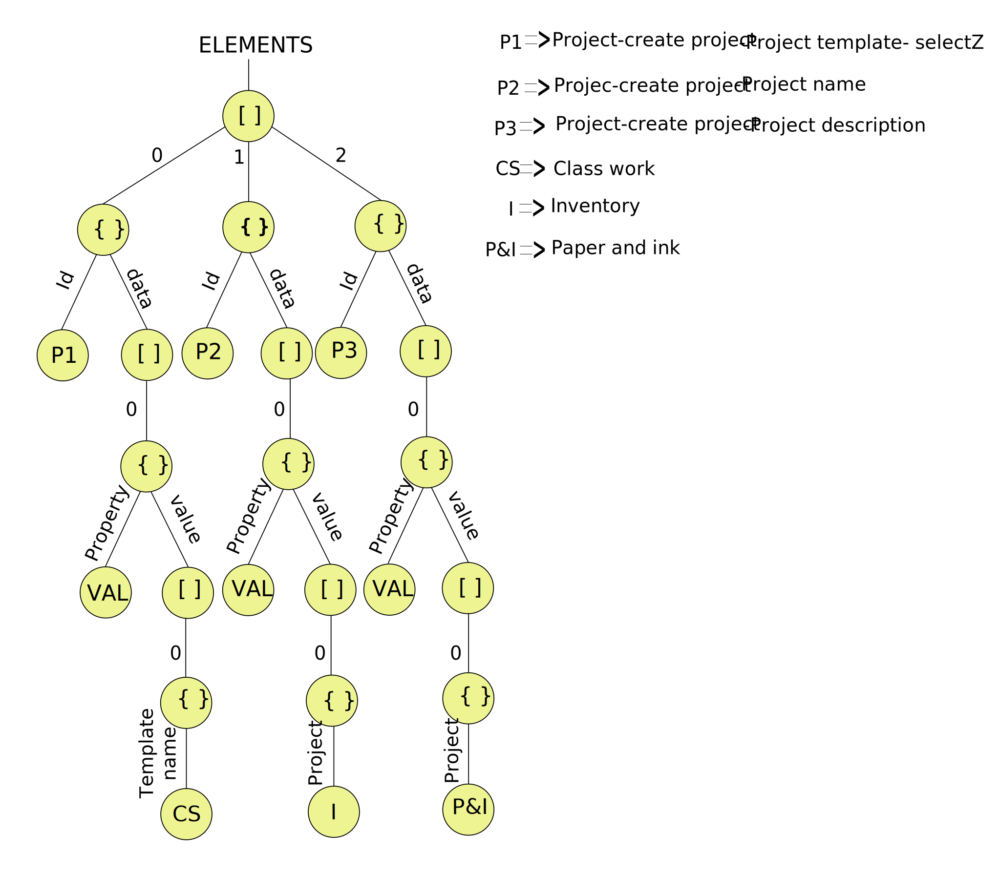

# JEQUEL

A declarative library to traverse and transform complex JSON structures like Trees.

## Declarative looping!

Eg this JSON:

```js
var bookStore = {
    "store": {
        "book": [
            {
                "category": "reference",
                "author": "Nigel Rees",
                "title": "Sayings of the Century",
                "price": 8.95
            },
            {
                "category": "fiction",
                "author": "Evelyn Waugh",
                "title": "Sword of Honour",
                "price": 12.99
            },
            {
                "category": "fiction",
                "author": "Herman Melville",
                "title": "Moby Dick",
                "isbn": "0-553-21311-3",
                "price": 8.99
            },
            {
                "category": "fiction",
                "author": "J. R. R. Tolkien",
                "title": "The Lord of the Rings",
                "isbn": "0-395-19395-8",
                "price": 22.99
            }
        ],
        "bicycle": {
            "color": "red",
            "price": 19.95
        }
    },
    "expensive": 10
}

// Increase the price of each book by Rs. 10 with JEQUEL. One liner :)
var newBookstore = bfsTransform(bookStore, '$/*/book', book => book.price += 10)

// The equivalent of doing this with plain `for`s and `forEach`es would be loooooong! ->
for (var key in bookStore){
    var books = bookStore[key]['book'];
    if (books instanceof Array){
        for (var i = 0; i<books.length; i++){
            books[i].price +=10;
        }
    }
    else {
        for (var bookKey in books){
            var book = books[bookKey];
            book.price +=10;
        }
    }
}  

console.log(newBookStore)

//Outputs
{
    "store": {
        "book": [
            {
                "category": "reference",
                "author": "Nigel Rees",
                "title": "Sayings of the Century",
                "price": 18.95
            },
            {
                "category": "fiction",
                "author": "Evelyn Waugh",
                "title": "Sword of Honour",
                "price": 22.99
            },
            {
                "category": "fiction",
                "author": "Herman Melville",
                "title": "Moby Dick",
                "isbn": "0-553-21311-3",
                "price": 18.99
            },
            {
                "category": "fiction",
                "author": "J. R. R. Tolkien",
                "title": "The Lord of the Rings",
                "isbn": "0-395-19395-8",
                "price": 32.99
            }
        ],
        "bicycle": {
            "color": "red",
            "price": 19.95
        }
    },
    "expensive": 10
}
``` 

Infact, for more number of `*`s in the `jsonPath` the more horridly long this code can become!

## JSON as Trees

The crucial theoretical concept to *grok* for `JEQUEL` is the fact that all JSONs are treated like `tree`s.
Example:

```js

[
	{
		k1: '1', k2: 'somedata', k3: [
			{id: 'a' e2a1: 'something a'}
			{id: 'b' e2a1: 'something b'}
			{id: 'c' e2a1: 'something c'}
		]
	},
	{
		k1: '2' k2: 'anothersomedata' k3: [
			{id: 'i' 	e2a1: 'something i'}
			{id: 'ii' 	e2a1: 'something ii'}
			{id: 'iii' 	e2a1: 'something iii'}
			{id: 'iv' 	e2a1: 'something iv'}
		]
	}
]
```

Can be represented as a tree with the following properties:

1. Arrays can be thought of as Objects having numeric keys.
2. A variable is a node.
3. A key is an edge.
4. Only String, Boolean, Number, Empty Array and Empty Object can be leaf nodes.

Graphically,



### JSON Pointer Notation

Any position in this tree can be specified with a JSON Pointer. For details consult [RFC6901](https://tools.ietf.org/html/rfc6901).

#### JSON Pointer extension.

Taking a cue from JSONPath, we have built a couple of extensions on JSON Pointer.

1. The wildcard `*` is used to match all keys.
2. The wildcard `$` is used to represent the root node of the JSON tree.
